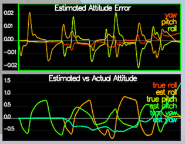
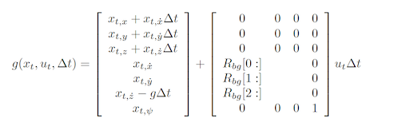
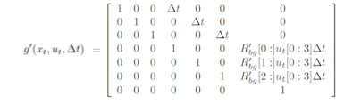
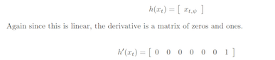
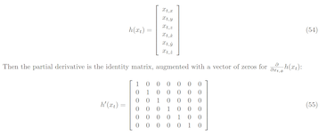

# Estimation Project #

Welcome to the estimation project.  In this project, I have developed the estimation portion of the controller used in the CPP simulator.  By the end of the project, the simulated quad is flying with the estimator and the custom controller (from the previous project)!

## Rubics ##


##### 1. Determine the standard deviation of the measurement noise of both GPS X data and Accelerometer X data. #####

I took the values from config/log/Graph1.txt (GPS X data) and config/log/Graph2.txt (Accelerometer X data) and copied them to excel notebook and found standard deviation from that. Hence I chanced the values to 

```
    MeasuredStdDev_GPSPosXY = 0.7161
    MeasuredStdDev_AccelXY = 0.5092
```

##### 2. Implement a better rate gyro attitude integration scheme in the UpdateFromIMU() function. #####

Implemented UpdateFromIMU using FromEuler123_RPY and IntegrateBodyRate.



##### 3. Implement all of the elements of the prediction step for the estimator. #####

I used the below formula to complete the implementation of GetRbgPrime, PredictState and Predict function.





##### 4. Implement the magnetometer update. #####

I used the below formula to complete the implementation of UpdateFromMag function.



##### 5. Implement the GPS update. #####

I used the below formula to complete the implementation of UpdateFromGPS function.




